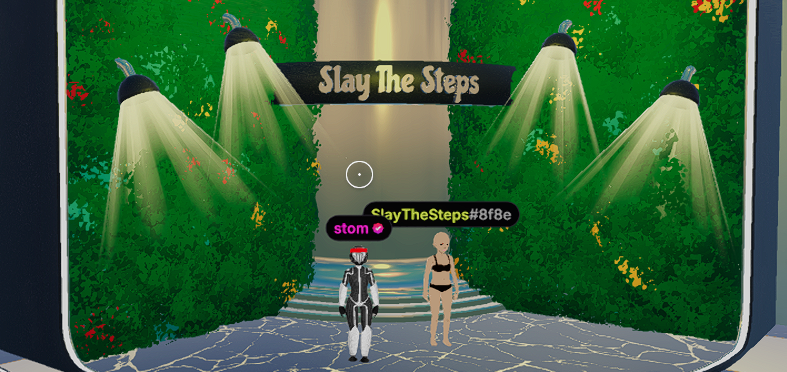

## `stom66/dcl-slay-the-steps`

# Slay the Steps

### Decentraland Festive Trail 2025 Experience

This repo contains the "Slay The Steps" experience, including all source assets used to create it, and the deployable scene itself.

---

## Contents

- [Repository Overview](#repository-overview)
- [Resources](#resources)
- [Getting Started](#getting-started)
  - [Pre-requisites](#pre-requisites)
  - [Using this template](#using-this-template)
  - [Preview the DCL scene](#preview-the-dcl-scene)

---

## Repository Overview

This repository is split in the following folders:

- `/assets`- asset sources
  - `/assets/blends` - source files for each model in the scene, including full res textures
  - `/assets/fbx` - exported fbx models for Substance Painter
  - `/assets/fonts` - any fonts used in the scene and accompanying media
  - `/assets/glb` - third-party glb files used in the project
  - `/assets/images` - misc images for the project
  - `/assets/sfx` - wav/audacity source files for music/sfx
  - `/assets/spp` - substance painter files
  - `/assets/tex` - asset agnostic textures used across the scene
- `/config` - useful info such as import/export settings, UVPackMaster Presets, shader templates
- `/dcl` - the DCL scene to be deployed.
  - `/dcl/assets`
    - `/dcl/assets/images` - SDK material images and UI assets
    - `/dcl/assets/models` - exported glTF files, and textures
    - `/dcl/assets/scene` - Creator Hub files
    - `/dcl/assets/sfx` - mp3 files, both music and sfx
- `/docs` - extra info on relevant topics, eg asset creation
- `/reference` - screenshots, previs, reference pictures used during asset creation
- `/scripts` - various bash/blender/bat utility scripts

## Resources

- Google Sheet - [DCL scene limits calculator](https://docs.google.com/spreadsheets/d/1p4aEoGuguFRqeSSXUCC4DLK-HQ8f1cHM2VzXApo7MBk/edit?usp=sharing)
- Guide - [Asset pipeline overview](/docs/ASSETS.md)
- Guide - [Automatic deployment via GitHub Actions](/docs/GITHUB_AUTOMATIC_DEPLOYMENT.md)
- Guide - [Updating DCL dependencies](/docs/UPDATE_DCL_DEPENDENCIES.md)

---

# Getting Started

## Pre-requisites

- **Previewing the scene**:

  - You will require the [Decentraland Creator Hub](https://decentraland.org/download/creator-hub/) to launch and host the scene.
  - You will require the [Decentraland Client](https://decentraland.org/download/) to join and view the scene.

- **Utility scripts** (optional)

  - Various dev scripts require bash (linux) to run.
  - They have been tested on Ubuntu under WSL.
  - See [DEPENDENCIES](/docs/DEPENDENCIES.md) for the required packages.

## Using this template

- [Using the template](/docs/USING_THE_TEMPLATE.md)
- [Asset pipeline overview](/docs/ASSETS.md)
- [Automatic deployment via GitHub Actions](/docs/GITHUB_AUTOMATIC_DEPLOYMENT.md)
- [Updating DCL dependencies](/docs/UPDATE_DCL_DEPENDENCIES.md)

## Preview the DCL scene

#### First-time setup

1. Launch the Decentraland Creator Hub
1. Select the "Scenes" tab
1. Select "Import Scene"
1. Navigate to the repository folder and select the `dcl` folder inside it.

#### Normal use

1. Launch the Decentraland Creator Hub
1. Select the scene from the home screen
1. Choose "Preview" at the top
1. This will fire up a local test server, and launch the Decentraland Client

---

## Known Bugs

- Lack of caffeine causes occassional I/O errors.

---

## License

This work is licensed under the Creative Commons Attribution-NonCommercial-NoDerivatives 4.0 International License. To view a copy of this license, visit <http://creativecommons.org/licenses/by-nc-nd/4.0/>, see the license included in this repository, or send a letter to Creative Commons, PO Box 1866, Mountain View, CA 94042, USA.
